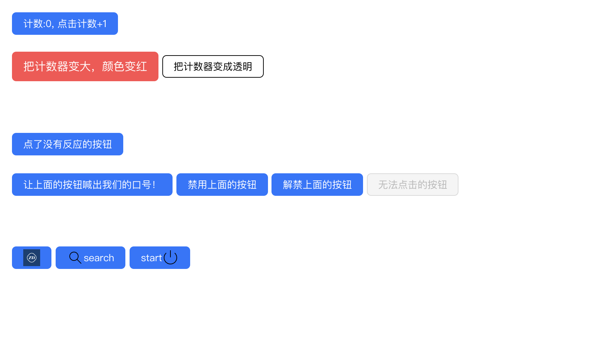

# `[P6-s2]` Button 按钮组件-增强版

## 项目阶段简介

### 项目阶段介绍

按照设计稿和组件说明，扩展基础版 Button 组件，实现增强版的 Button 组件

### 组件说明

- 增加按钮禁用功能
- 增加按钮图标功能
- 增加修改按钮回调函数功能

### 设计稿说明

- 整个设计稿分为 3 部分，首先最上面的第一部分跟 s1 一样，这一部分的代码也要从 s1 的答案中 copy 过来，功能保持不变。需要注意的是，在完成基础版的 Button 组件扩展之后，要保证 s1 要求的功能仍然正确，也就是说，我们 s2 的扩展是向下兼容的
- 中间部分有两行按钮：
  - 首先第一行的按钮是被控制的按钮，这个按钮一开始是没有设置点击回调函数的，也就是说，这个按钮可以被点击，但是点击之后没有任何反应
  - 第二行的按钮是控制上面按钮的，从左往右分别为：
    - 点击第一个按钮之后，上面的按钮的文案改成【我们的口号是...】，同时给上面的按钮设置一个回调函数，逻辑是让页面弹出提醒弹窗，内容为【学前端，来之道 —— 陪伴式自学前端圈子】
    - 点击第二个按钮之后，上面的按钮会被设置为禁用状态，这时，上面的按钮无法点击
    - 点击第三个按钮之后，上面的按钮会被解除禁用状态，这时，上面的按钮可以被点击
    - 第四个按钮是 Button 组件的禁用状态，它无法被点击，这也是 Button 禁用状态的默认样式

- 下面部分只有一行按钮，用来展示 Button 组件的按钮图标功能，从左往右分别为：
  - 没有文字，只有图标的按钮
  - 图标在文字左边的按钮
  - 图标在文字右边的按钮

> [在线体验](https://zhidaofe.github.io/P6-button-component/s2/index.html)

### 项目要求

- 增强版是要在基础版的 Button 组件上进行扩展的，因此把你的 s1 答案 copy 过来之后，再进行 s2 的练习
- 先按照设计稿和组件说明，实现组件代码。然后在页面中使用你实现的组件来达到题目要求
- 保证最终实现的页面完全复现设计稿，真实的工作中，火眼金睛的设计师 1 px 的差异都能找到，不要心存侥幸
- **先按照设计稿和组件说明真得去开发，不要看参考答案！**，也不要去看业界和开源的组件库代码
- 如果开发过程中碰到问题，不知道怎么实现的话，去网上查找答案，不要去看答案！在真实的工作中，你不会有参考答案的，你只能自己想办法找到问题的解决方案
- 记录你的疑问，比如：
  - 有个很难实现的地方，总感觉自己实现的方案不是最优方案，还有更好的方案
  - 不知道自己的实现方案到底好不好
  - 完成开发之后，再整体 review 一遍自己的代码，觉得还有哪些地方是不够好的

- 带着你的疑问，再去查看参考答案或者开源组件库去寻找答案，如果还是没有得到解答，请来 [**之道前端**](https://kcnrozgf41zs.feishu.cn/wiki/PBj0w5rjUiEWVgktZE0caKOunNc) 提问

### 练习本项目你会收获什么？

- 提升原生 JavaScript 的编码熟练度
- 学会正确使用原生 JavaScript 操作 Dom
- 学会正确使用原生 JavaScript 处理 DOM 事件
- 学会如何封装一个组件
- 【进阶】深刻理解什么是好的组件
- 【进阶】积累封装组件的经验
- 【进阶】逐渐形成自己的 JavaScript 代码风格

> 如果只实践一次，那就只会有基础收获
>
> 只有不断练习、思考、优化，才会有进阶收获

### 本项目适合的同学

- 处于 L2 水平的同学
- 对原生 JavaScript 还不熟练的同学
- 没怎么封装过 UI 组件的同学
- 没怎么写过 C 端页面，大部分时间在做 admin 系统的同学
- 只会开发 React/Vue 组件，想要练习如何封装原生 JavaScript 组件的同学

## 开始练习

我们针对不同经验的同学提供了相应的[练习指引手册](https://kcnrozgf41zs.feishu.cn/wiki/An7GwvUQrirdvdkJdQ9c4q3Rndd)，你可以按照这个指引手册来练习本项目。

